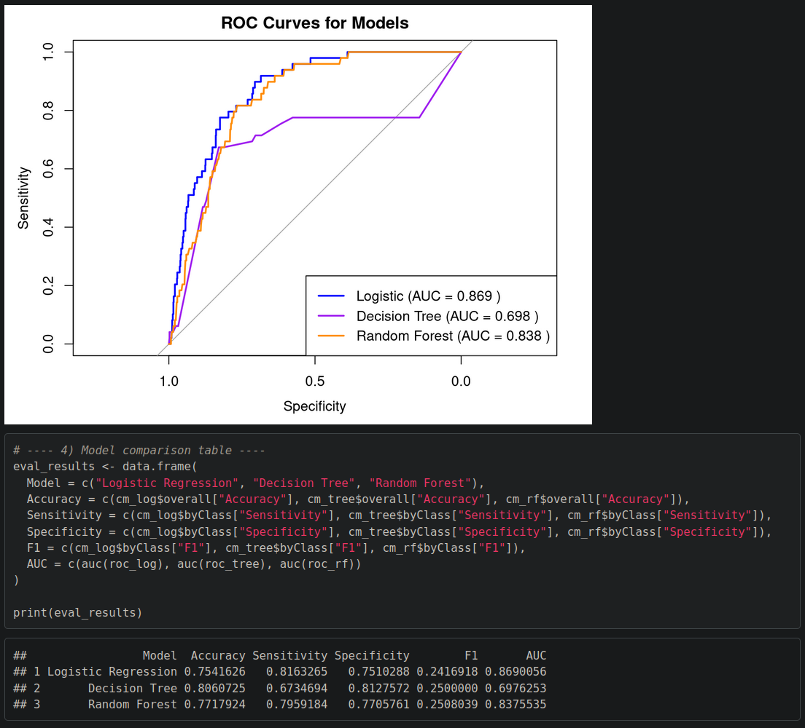
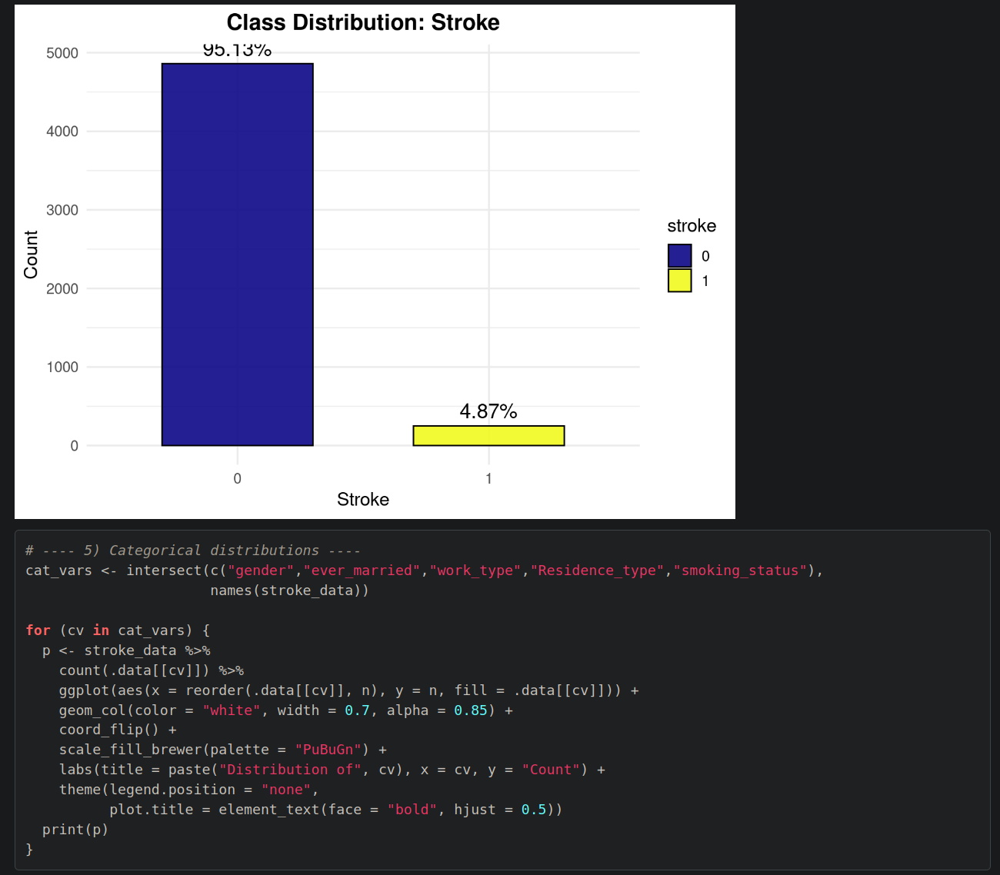

# 🧠 Stroke Prediction Model in R

This project builds and deploys a **stroke prediction model** using R.  
The workflow includes data preprocessing, exploratory data analysis (EDA), model training, model evaluation, and deployment.  
The final trained model is saved and can be reused for making predictions.

Visit: https://parbproject.github.io/Stroke/ for the full project. 

---

## 📊 Dataset
The dataset comes from [Kaggle – Stroke Prediction Dataset]([https://www.kaggle.com/datasets/fedesoriano/stroke-prediction-dataset](https://parbproject.github.io/Stroke/)).  

It includes patient information such as:
- Gender, age, marital status, work type, residence type  
- Health factors (hypertension, heart disease, average glucose level, BMI)  
- Lifestyle factors (smoking status)  
- Stroke outcome (target variable: 1 = stroke, 0 = no stroke)

---

## ⚙️ Features
- Data cleaning & preprocessing (handling missing values, factors, scaling)  
- Exploratory Data Analysis (EDA) with visualizations  
- Machine learning models:
  - Logistic Regression  
  - Decision Tree  
  - Random Forest  
- Model evaluation using:
  - Accuracy  
  - ROC-AUC  
  - Sensitivity & Specificity  
  - F1 Score  
- Deployment-ready model saved as `.rds`  

---

---

<h2>📸 Screenshots</h2>

<p align="center">
  <br>
  <em>Figure 1: Data exploration</em>
</p>

<p align="center">
  <br>
  <em>Figure 2: Model evaluation</em>
</p>


---

## 📂 Repository Structure


├── stroke-report.Rmd # Main R code/report

├── healthcare-dataset-stroke-data.csv # Dataset (if included)

├── best_stroke_model.rds # Saved best model

├── training_levels.rds # Factor levels for categorical variables

├── docs/

│ ├── index.html # Rendered HTML report (for GitHub Pages)

│ └── stroke-report.pdf # PDF report (optional)

└── README.md # Project documentation


---

## 🚀 Deployment
This project is deployed using **GitHub Pages**.  

- HTML report: [https://<your-username>.github.io/<your-repo>/](https://<your-username>.github.io/<your-repo>/)  
- PDF report: [https://<your-username>.github.io/<your-repo>/stroke-report.pdf](https://<your-username>.github.io/<your-repo>/stroke-report.pdf)

*(Replace `<your-username>` and `<your-repo>` with your GitHub details.)*

---

## 🔧 How to Run Locally
Clone this repo and run in R:

```r
# Install dependencies
install.packages(c("tidyverse","readr","viridis","RColorBrewer",
                   "caret","randomForest","rpart","pROC","rmarkdown"))

# Knit the report (HTML or PDF)
rmarkdown::render("stroke-report.Rmd", output_format = "html_document")
# or
rmarkdown::render("stroke-report.Rmd", output_format = "pdf_document")


👤 Author: Analytic Avenger
📅 Last updated: September 2025
