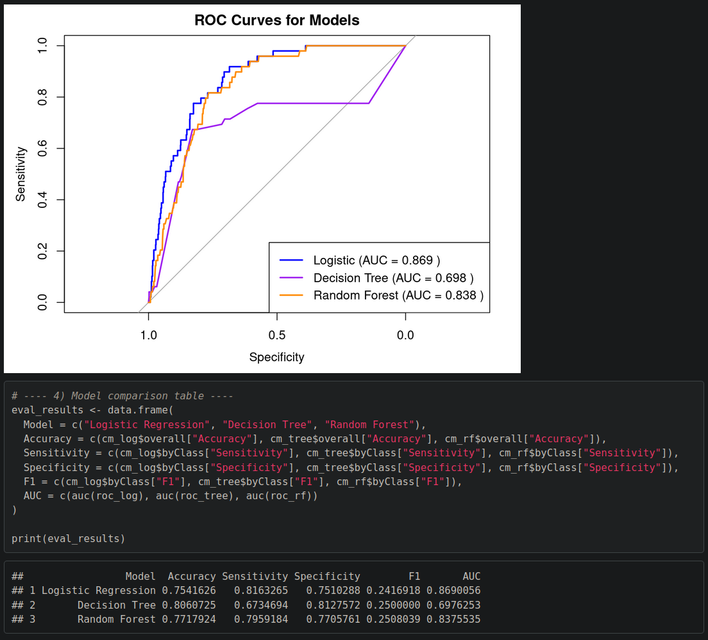
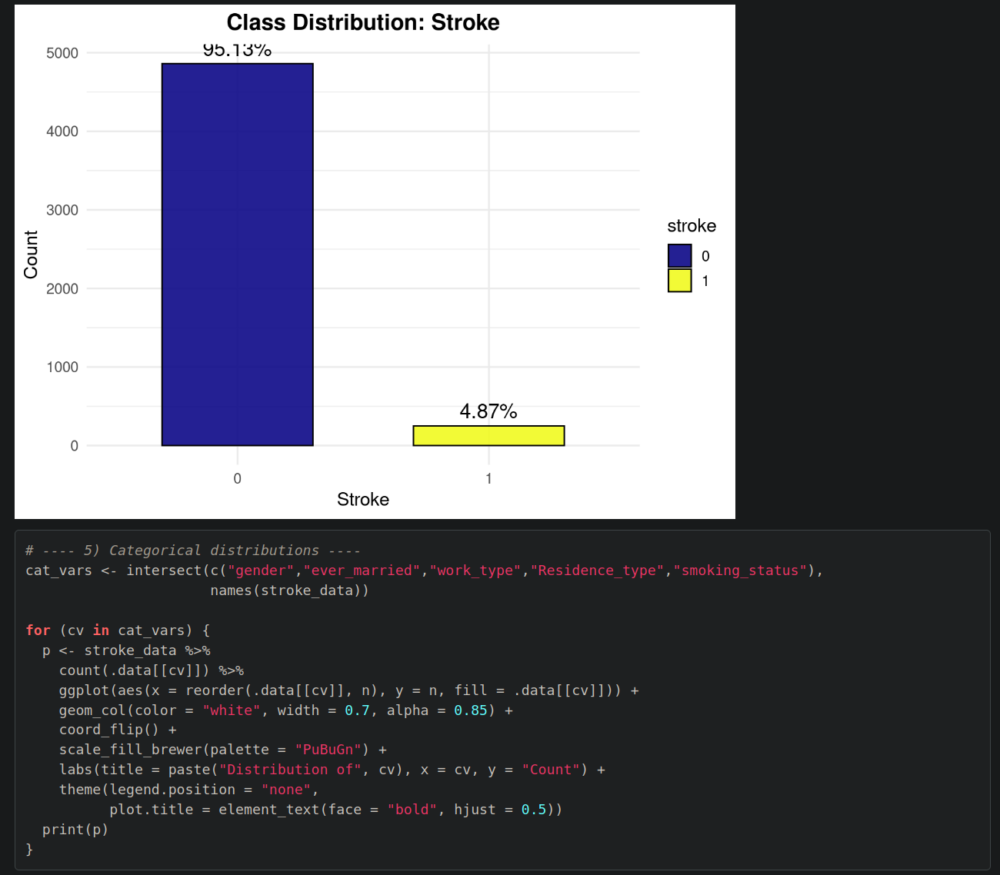

# Stroke Risk Prediction in R

An end-to-end R analytics case study covering data preparation, exploratory analysis, supervised learning, model comparison, and communication of results for a stroke-risk dataset.

## Live Report

**[View the complete rendered analysis](https://parbproject.github.io/Stroke/)**

## Project Workflow

1. Inspect and clean demographic, health, and lifestyle variables.
2. Explore class balance, missing values, and feature relationships.
3. Prepare categorical and numeric predictors for modelling.
4. Compare logistic regression, decision tree, and random forest approaches.
5. Evaluate classification performance using ROC-AUC, sensitivity, specificity, and F1 score.
6. Present findings in a reproducible R Markdown report.

## Preview

  

  

## Dataset

The project uses the [Stroke Prediction Dataset on Kaggle](https://www.kaggle.com/datasets/fedesoriano/stroke-prediction-dataset). Features include age, hypertension, heart disease, average glucose level, BMI, smoking status, residence type, and the observed stroke outcome.

## Repository Contents

| File | Purpose |
|---|---|
| [Build-deploy-stroke-prediction-model-R.Rmd](Build-deploy-stroke-prediction-model-R.Rmd) | Reproducible source analysis |
| [Build-deploy-stroke-prediction-model-R.html](Build-deploy-stroke-prediction-model-R.html) | Rendered report |
| [healthcare-dataset-stroke-data.csv](healthcare-dataset-stroke-data.csv) | Analysis dataset |
| [index.html](index.html) | GitHub Pages entry point |

## Reproduce the Analysis

~~~r
install.packages(c(
  "tidyverse", "readr", "viridis", "RColorBrewer",
  "caret", "randomForest", "rpart", "pROC", "rmarkdown"
))

rmarkdown::render(
  "Build-deploy-stroke-prediction-model-R.Rmd",
  output_format = "html_document"
)
~~~

## Skills Demonstrated

R, R Markdown, data cleaning, exploratory data analysis, classification, model comparison, evaluation metrics, and technical reporting.

## Responsible Use

This project is educational and is not a clinical diagnostic tool. Medical decisions require validated models, appropriate governance, and review by qualified healthcare professionals.
