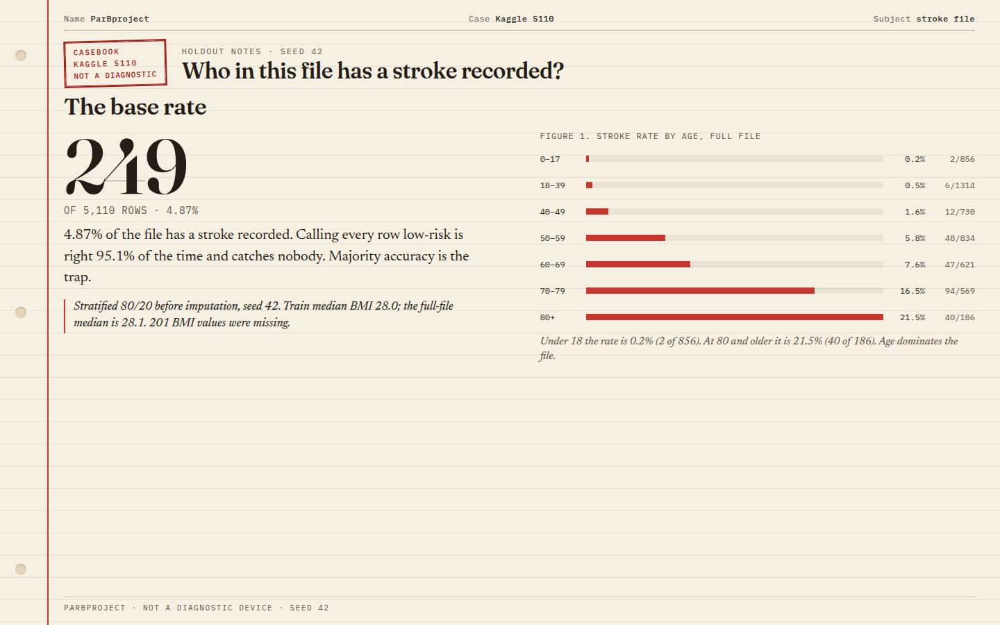
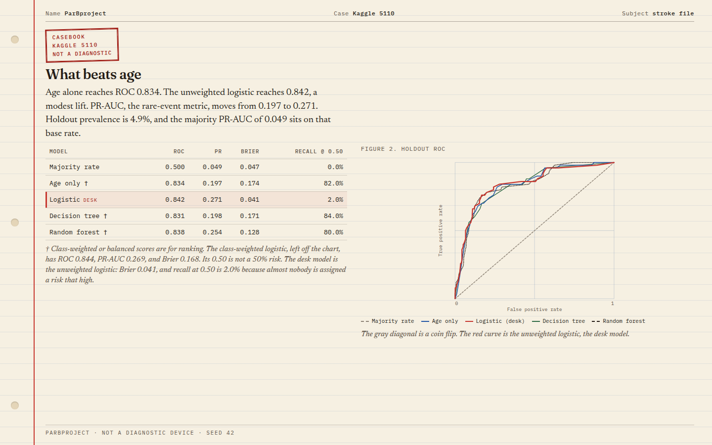
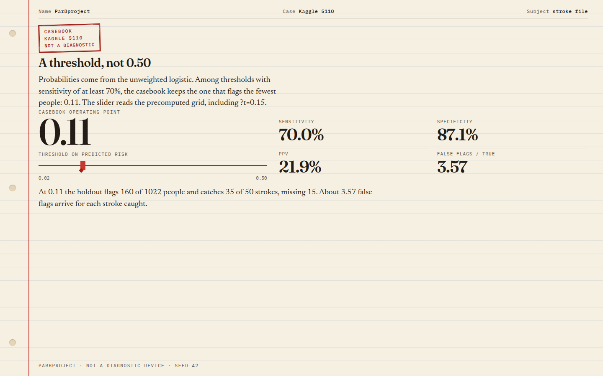
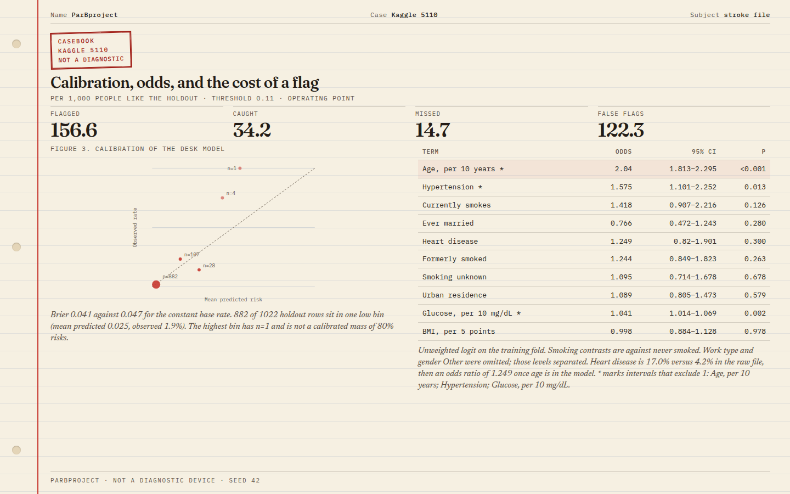

# Stroke casebook

A holdout study of the [Kaggle stroke prediction file](https://www.kaggle.com/datasets/fedesoriano/stroke-prediction-dataset): 249 strokes in 5,110 rows. The page is a composition-notebook casebook, not a diagnostic tool.

**[Open the casebook](https://parbproject.github.io/Stroke/)**

## Question

Can a simple model flag people in this file who have a stroke recorded, without pretending that accuracy or a 0.50 cutoff is a clinical risk?

## Method

The split comes first. A stratified 80/20 holdout, seed 42, is cut before any imputation. Missing BMI (201 rows) is filled with the **training** median (28.0). The full-file median is 28.1 and is not used.

Five scores are compared on the holdout:

| Role | Model |
|---|---|
| Baseline | Majority rate (always the training prevalence) |
| Baseline | Age-only logistic, class-weighted, for ranking |
| Desk model | Unweighted logistic. These are the probabilities used for calibration, Brier, and the threshold |
| Comparison | Decision tree, depth 4, minimum leaf 40, balanced |
| Comparison | Random forest, 300 trees, depth 8, minimum leaf 20, balanced subsample |

A class-weighted logistic is fit only as a ranking footnote. Its scores are not risks, and 0.50 on that model is not a 50% chance.

ROC-AUC describes ranking. PR-AUC is the rare-event metric: the majority model’s PR-AUC sits on the ~4.9% base rate. The operating point is read from the unweighted logistic only: the lowest-flag threshold whose sensitivity is at least 0.70.

Odds ratios are a separate unweighted logit on the training fold (age per 10 years, glucose per 10 mg/dL, BMI per 5, hypertension, heart disease, married, urban, smoking). `gender == Other` is dropped. Work type is omitted because those levels separated and produced infinite intervals.

## What the holdout shows

Numbers are from `casebook/metrics.json` (seed 42).

- Prevalence **4.87%** (249 / 5,110). Calling every row low-risk is right about **95.1%** of the time and catches nobody. Majority recall at 0.50 is **0**.
- Stroke rate is **0.2%** under 18 (2 / 856) and **21.5%** at 80 and older (40 / 186).
- ROC-AUC: majority **0.500**, age only **0.834**, unweighted logistic **0.842**, tree **0.831**, forest **0.838**. The full logistic only modestly beats age.
- PR-AUC: majority **0.049**, age only **0.197**, unweighted logistic **0.271**, forest **0.254**.
- Brier: unweighted logistic **0.041**, majority **0.047**. The class-weighted logistic’s Brier is **0.168** with ROC **0.844**. Similar rank, not a probability.
- Operating threshold **0.11** (sensitivity **0.70**, specificity **0.871**, PPV **0.219**, **3.57** false flags per true stroke).
- Per 1,000 people like the holdout, that threshold flags **156.6**, catches **34.2**, misses **14.7**, and raises **122.3** false flags.
- Age odds ratio **2.04** per 10 years (95% CI **1.81–2.30**). Hypertension **1.58**. Glucose **1.04** per 10 mg/dL. BMI, after age, is about **1.00**.

## Casebook









The live page is `casebook/index.html` (the repository root redirects there, including `?shot=` and `?t=`). `?t=0.15` pins a threshold. `?shot=open|models|point|burden` isolates one spread.

## Run

```bash
python3 -m casebook.analyze
pytest -q
python3 -m http.server
```

Then open `http://127.0.0.1:8000/`. Analysis dependencies are in `requirements.txt` (pandas, numpy, scikit-learn 1.9, statsmodels 0.15, pytest).

`archive/Build-deploy-stroke-prediction-model-R.Rmd` is an earlier unmaintained pass, kept for the record. The [casebook](https://parbproject.github.io/Stroke/) is the analysis this repository stands on.

## Disclaimer

Educational casebook on a public Kaggle file. Not a diagnostic device and not validated for clinical use.
