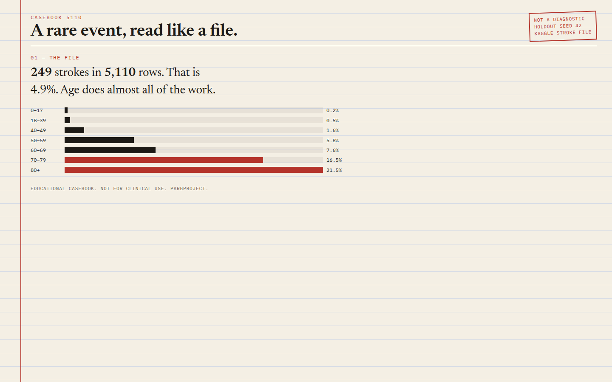
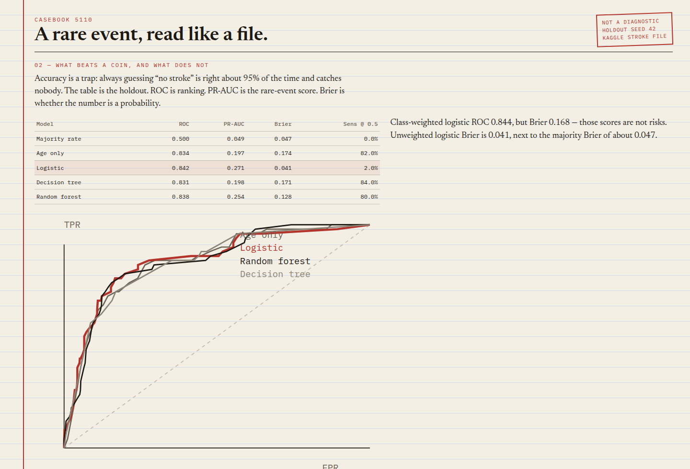
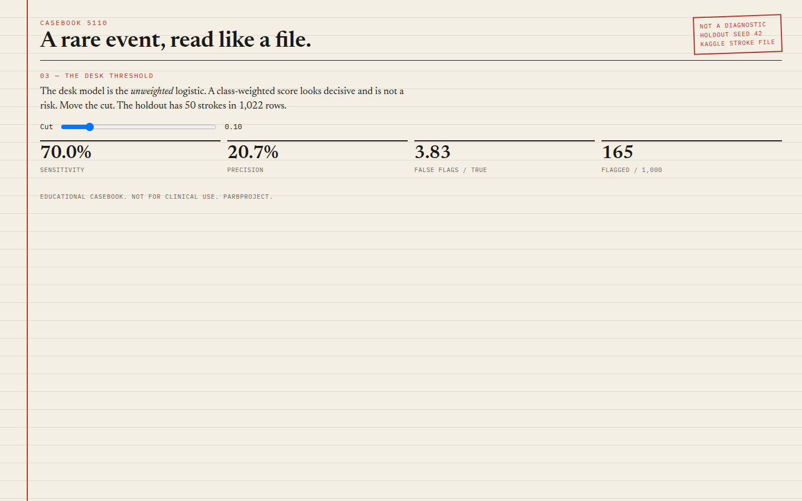
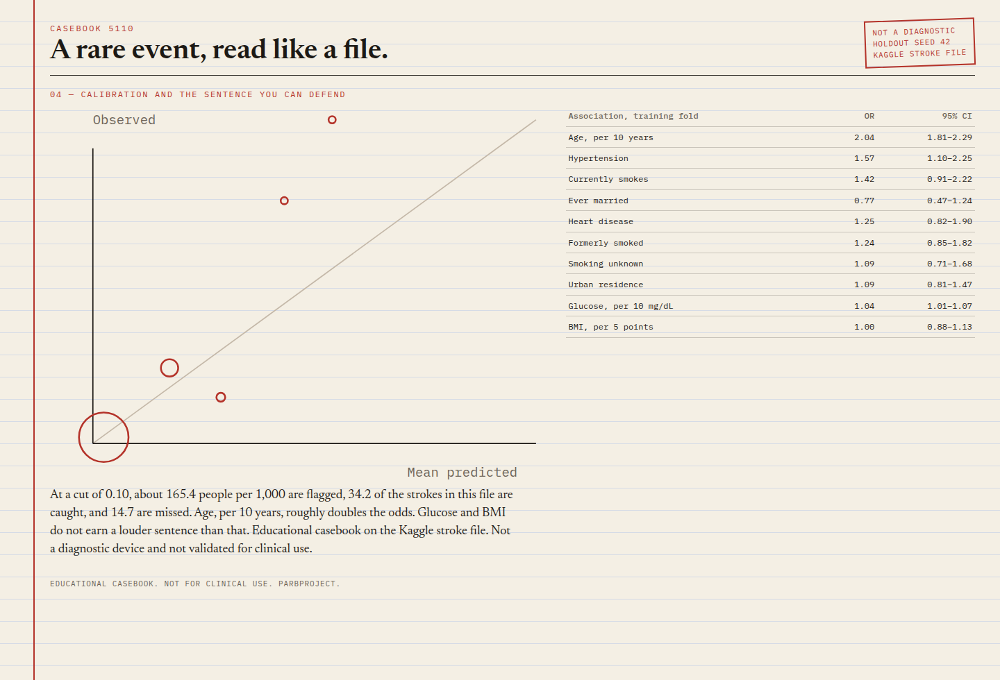

# Casebook 5110 — stroke file, read for a data analyst interview

**Put this on a data analyst or AI data analyst resume.** The question is not “can you fit a random forest.” It is: a 4.9% event makes accuracy meaningless, age already ranks the file, and a 0.50 cutoff on an unweighted model catches almost nobody.

<p align="center">
  
</p>

## The holdout, in one table

Stratified 80/20 split, seed 42, **before** BMI imputation. 1,022 holdout rows, 50 strokes.

| Model | ROC-AUC | PR-AUC | Brier | Sensitivity at 0.50 |
|---|---:|---:|---:|---:|
| Majority rate | 0.500 | 0.049 | 0.047 | 0% |
| Age only | 0.834 | 0.197 | 0.174 | 82% |
| **Logistic (desk)** | **0.842** | **0.271** | **0.041** | 2% |
| Logistic, class-weighted | 0.844 | 0.269 | 0.168 | 80% |
| Decision tree | 0.831 | 0.198 | 0.171 | 84% |
| Random forest | 0.838 | 0.254 | 0.128 | 80% |

Class-weighted scores rank about as well as the plain logistic and then lie about the probability (Brier 0.168 versus 0.041). The desk model is the unweighted logistic.

<p align="center">
  
</p>

## Operating point

On the desk model, the cut with sensitivity at least 70% and the fewest flags is **0.10**.

| | Holdout | Per 1,000 people in this file |
|---|---:|---:|
| Sensitivity | 70% | — |
| Precision | 20.7% | — |
| False flags per true stroke | 3.8 | — |
| Flagged | 169 / 1,022 | 165 |
| Strokes caught | 35 | 34 |
| Strokes missed | 15 | 15 |

<p align="center">
  
</p>

## What you can say out loud

Age, per 10 years, multiplies the odds by about **2.04** (95% CI 1.81–2.30) on the training fold. Hypertension is next (OR 1.58). Glucose and BMI move the odds much less. The calibration plot stays near the diagonal in the bulk of the file, where almost everyone sits below a 12% predicted risk.

<p align="center">
  
</p>

## How this should be used in a job search

- **Data analyst:** open with the age strip, the majority-class trap, and the per-1,000 burden.
- **AI data analyst:** open with why class weights wreck calibration, why PR-AUC beats accuracy, and why the forest does not earn the logistic’s job.
- The R Markdown in this repo is an earlier pass. The page and `casebook/analyze.py` are the maintained analysis.

## Reproduce

```bash
python -m pip install -r requirements.txt
python -m casebook.analyze
python -m pytest -q
python -m http.server 8000
```

Open http://localhost:8000. The cut slider recomputes sensitivity, precision, and flags from the precomputed holdout grid.

## Responsible use

Educational casebook on the public Kaggle stroke file. Not a diagnostic device. A real screening tool needs a prospective cohort, calibration in the population you would actually flag, and a clinician deciding what a false flag costs.
