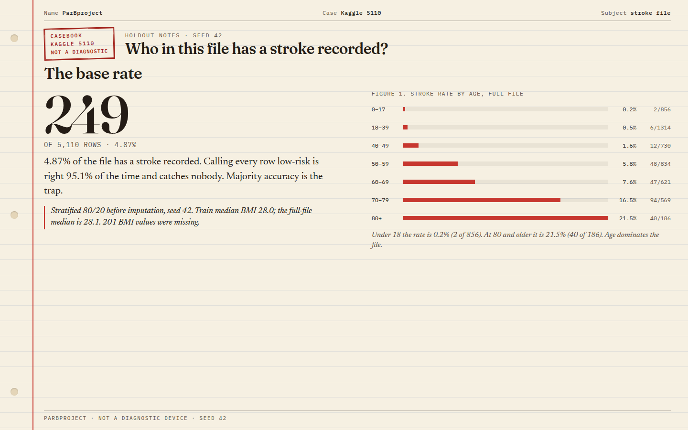
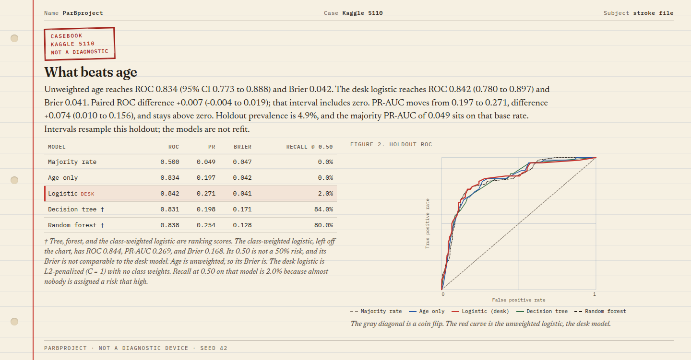
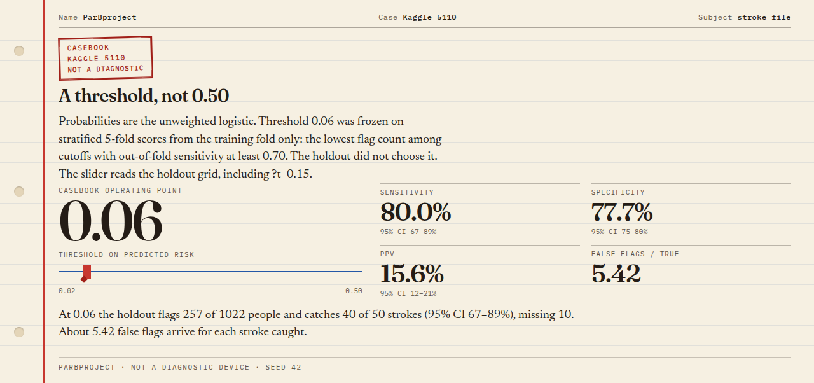
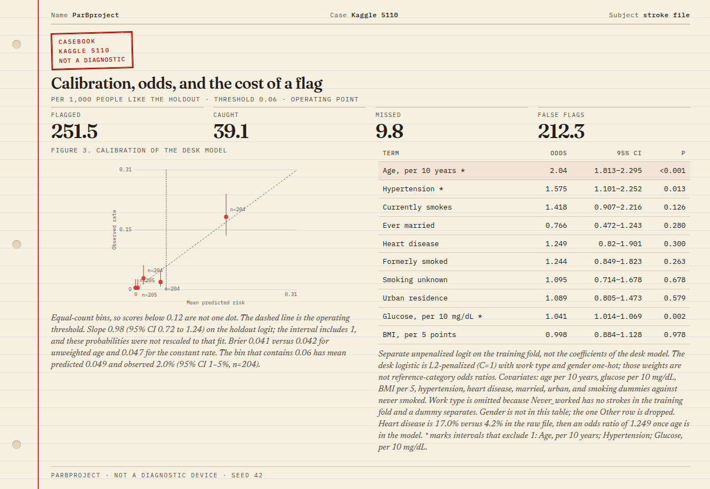

# Stroke casebook

A holdout study of the [Kaggle stroke prediction file](https://www.kaggle.com/datasets/fedesoriano/stroke-prediction-dataset): 249 strokes in 5,110 rows. The page is a composition-notebook casebook, not a diagnostic tool.

**[Open the casebook](https://parbproject.github.io/Stroke/)**

## Question

Can a simple model flag people in this file who have a stroke recorded, without pretending that accuracy or a 0.50 cutoff is a clinical risk?

## Method

The split comes first. A stratified 80/20 holdout, seed 42, is cut before any imputation, scaling, or encoding. Missing BMI (201 rows) is filled with the **training** median (28.0) inside the pipeline. The full-file median is 28.1 and is not used. The training fold is not resampled.

Five scores are compared on the holdout:

| Role | Model |
|---|---|
| Baseline | Majority rate (always the training prevalence) |
| Baseline | Age-only logistic, unweighted, so its Brier is a probability and can be compared with the desk model |
| Desk model | L2-penalized logistic, C = 1, no class weights. These are the probabilities used for calibration, Brier, and the threshold |
| Comparison | Decision tree, depth 4, minimum leaf 40, balanced |
| Comparison | Random forest, 300 trees, depth 8, minimum leaf 20, balanced subsample |

A class-weighted logistic is fit only as a ranking footnote. Its scores are not risks, and 0.50 on that model is not a 50% chance.

ROC-AUC describes ranking. PR-AUC is the rare-event metric: the majority model’s PR-AUC sits on the ~4.9% base rate. Uncertainty on those two, and on Brier, is a paired percentile bootstrap of the holdout rows (2,000 resamples, seed 42). The fitted models are not refit inside the bootstrap. Sensitivity, specificity, and PPV use Wilson intervals on the holdout counts. The operating threshold is frozen on the training fold only. Stratified 5-fold out-of-fold probabilities from the unweighted logistic are swept from 0.02 to 0.50, and the cutoff is the lowest-flag point whose out-of-fold sensitivity is at least 0.70. The logistic is then refit on the full training fold and that cutoff is applied once to the holdout. The slider is a description of the holdout grid, including `?t=0.15`. It does not choose the cutoff.

Odds ratios are a separate unpenalized logit on the training fold (age per 10 years, glucose per 10 mg/dL, BMI per 5, hypertension, heart disease, married, urban, smoking). They are not the coefficients of the desk model: that model is L2-penalized and one-hot encodes work type and gender without a reference level. `gender == Other` is dropped, and gender is not a term in the association model. Work type is omitted because `Never_worked` has no strokes in the training fold, so a dummy separates. The other work-type levels do not.

## What the holdout shows

Numbers are from `casebook/metrics.json` (seed 42).

- Prevalence **4.87%** (249 / 5,110). Calling every row low-risk is right about **95.1%** of the time and catches nobody. Majority recall at 0.50 is **0**.
- Stroke rate is **0.2%** under 18 (2 / 856) and **21.5%** at 80 and older (40 / 186).
- ROC-AUC: majority **0.500**, age only **0.834** (95% bootstrap CI **0.773–0.888**), desk logistic **0.842** (**0.780–0.897**), tree **0.831**, forest **0.838**. The paired ROC difference, desk minus age, is **+0.007** (**−0.004 to +0.019**) and includes zero.
- PR-AUC: majority **0.049**, age only **0.197**, desk logistic **0.271**, forest **0.254**. The paired PR-AUC difference is **+0.074** (**0.010–0.156**) and stays above zero.
- Brier: desk logistic **0.041**, unweighted age **0.042**, majority **0.047**. The paired Brier difference is **−0.001** (**−0.003 to 0.000**) and includes zero, so the fuller model does not beat age as a probability. The class-weighted logistic’s Brier is **0.168** with ROC **0.844**. Similar rank, not a probability.
- Calibration slope of the desk probabilities, fit on the holdout only as a check, is **0.981** (95% CI **0.722–1.24**) and includes 1. Those probabilities are not rescaled to the slope. The reliability diagram uses five equal-count bins, because equal-width bins on 0–1 put the operating threshold and most of the holdout into one bar.
- Operating threshold **0.06**, frozen on training out-of-fold scores (out-of-fold sensitivity **0.7337**, specificity **0.7701**, PPV **0.1404**, 1,040 of 4,088 training rows flagged). On the holdout that cutoff has sensitivity **0.80** (40 / 50; Wilson 95% CI **0.67–0.89**), specificity **0.7767** (**0.75–0.80**), PPV **0.1556** (**0.12–0.21**), and **5.42** false flags per true stroke.
- Per 1,000 people like the holdout, that threshold flags **251.5**, catches **39.1**, misses **9.8**, and raises **212.3** false flags.
- Choosing the same rule on the holdout instead freezes **0.11** (sensitivity **0.70**, specificity **0.8714**, PPV **0.2188**, **3.57** false flags per true stroke; per 1,000: flagged **156.6**, caught **34.2**, missed **14.7**, false flags **122.3**). That is what this page used to publish. It uses the evaluation labels to pick the cutoff, so it is not the operating point.
- Age odds ratio **2.04** per 10 years (95% CI **1.81–2.30**). Hypertension **1.58**. Glucose **1.04** per 10 mg/dL. BMI, after age, is about **1.00**.

## Casebook









The live page is `casebook/index.html` (the repository root redirects there, including `?shot=` and `?t=`). `?t=0.15` pins a threshold. `?shot=open|models|point|burden` isolates one spread.

## Run

```bash
python3 -m pip install -r requirements.txt
PYTHONHASHSEED=42 OPENBLAS_NUM_THREADS=1 OMP_NUM_THREADS=1 MKL_NUM_THREADS=1 python3 -m casebook.analyze
pytest -q
python3 -m http.server
```

Then open `http://127.0.0.1:8000/`. Dependencies are pinned in `requirements.txt` (pandas 3.0.6, numpy 2.5.3, scikit-learn 1.9.1, scipy 1.18.1, statsmodels 0.15.0, pytest 9.1.1). The same thread limits are set in CI.

`archive/Build-deploy-stroke-prediction-model-R.Rmd` is an earlier unmaintained pass, kept for the record. It imputes medians before the split and picks a model by holdout AUC. Those numbers are not reproduced here. The Python casebook is the analysis this repository stands on.

## Disclaimer

Educational casebook on a public Kaggle file. Not a diagnostic device and not validated for clinical use.
